<div align="center">

# 💡 BirFikrimVar

**A student idea-sharing platform: post an idea, get it moderated, and collect likes and feedback. English and Arabic (RTL).**

*Bir fikrim var — fikrini paylaş, birlikte büyüyelim.*

<br/>

[](__LIVE_URL__)

<br/>


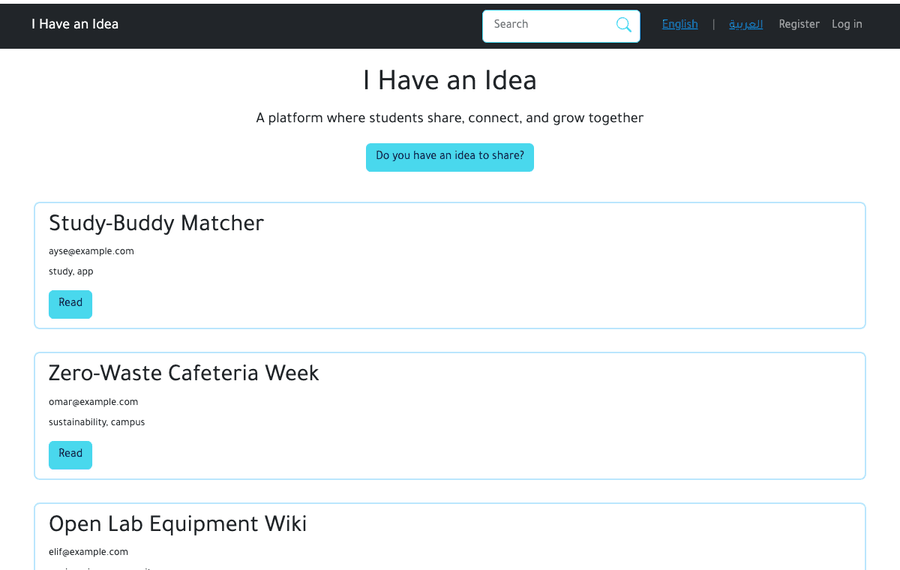

</div>

> **Originally built with ASP.NET MVC 5 (.NET Framework); ported to ASP.NET Core 8 for cross-platform hosting.**
> Original code: [`legacy-net-framework`](../../tree/legacy-net-framework) branch.

## Overview

BirFikrimVar ("I have an idea" in Turkish) is a small community site where students publish ideas as multi-section posts (text and an optional image per section). Nothing goes public until an administrator approves it, other students can like, save and comment on published ideas, and the whole interface switches between English and Arabic with proper right-to-left layout.

It started as a university project on ASP.NET MVC 5 with SQL Server. This repository holds the **ASP.NET Core 8 port** (same features, structure, models and UI) that runs on Linux and in Docker, plus a round of security fixes found while porting (see [Security](#security)).

## 🚀 Live demo

**<__LIVE_URL__>**

- **Demo account** (shown on the login page): `demo@birfikrimvar.app` / `Demo-Pass-2026`. A regular user: browse, like, save, comment, and submit a post.
- Posts you submit go to the moderation queue, so they won't appear on the home page until an admin publishes them. The admin flow is shown in the GIF above; admin credentials are not public.
- The demo contains **invented data only**.
- ⏳ It runs on Render's free tier, which **sleeps when idle**. The first request after a pause can take **~30–60 seconds** to wake up.

## Features

- **Accounts:** register, log in/out, change password (ASP.NET Core Identity, lockout after 5 failed logins).
- **Posts:** title, tags, and any number of sections, each with text, an optional image and a sort order.
- **Moderation:** new posts are *pending*. Users in the `Admin` role review them under `/Admin/ManagePost` and **publish** or **reject** them.
- **Feed and search:** published posts newest first; search by title or tags (published posts only).
- **Likes:** like/unlike a post, see the like count and the list of likers.
- **Save for later:** keep a personal list of saved posts.
- **Feedback:** send a comment to a post's author; authors (and admins) read it in the post's inbox.
- **English / Arabic:** language switch stored in a cookie; Arabic renders right-to-left.
- **Demo data:** optional seeding of invented posts, likes and comments (`Seed__DemoData`).

## Screenshots

| Home | Post details |
|---|---|
| 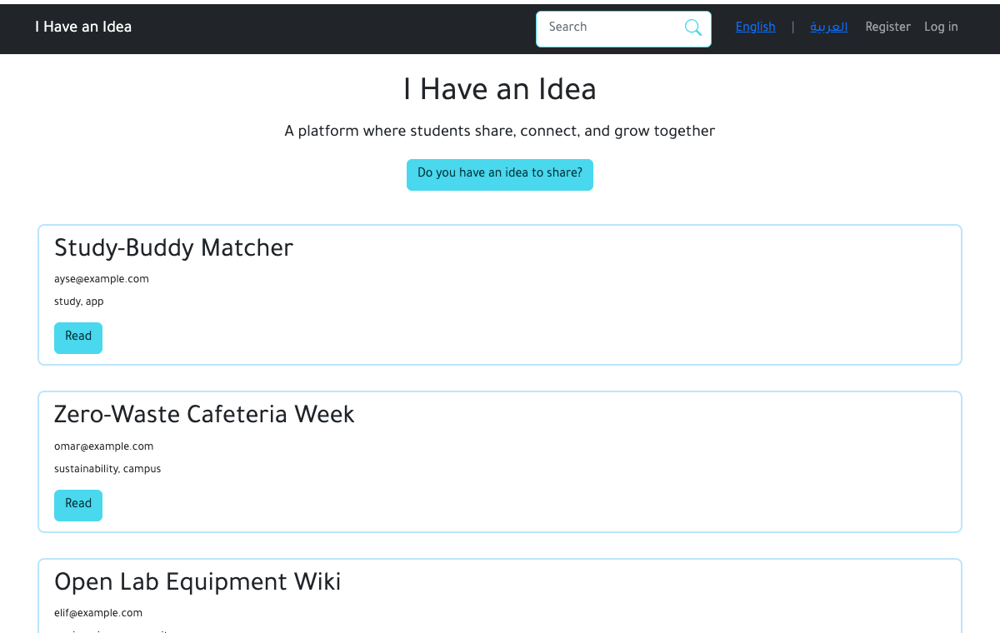 | 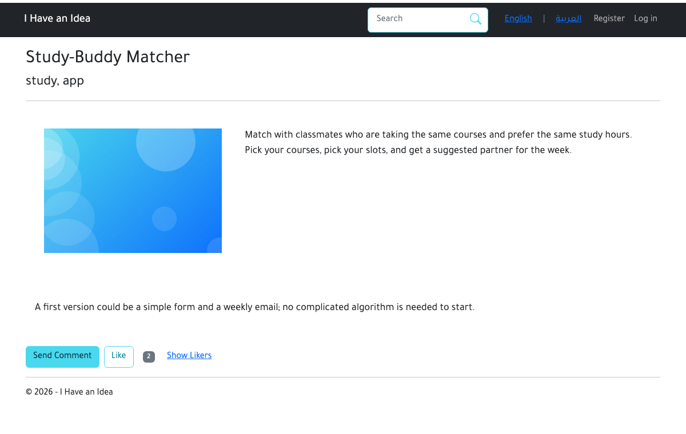 |
| **Arabic (RTL)** | **Search** |
| 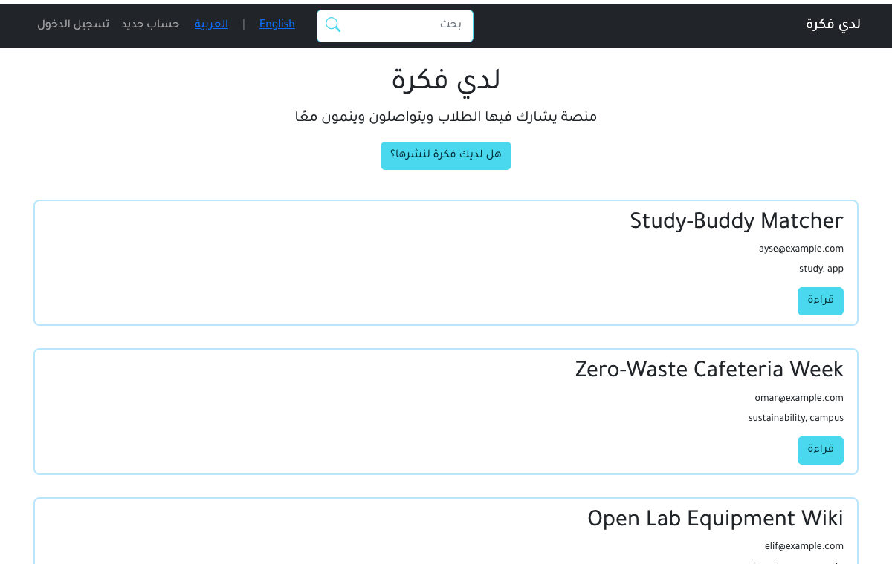 |  |
| **Create a post** | **Login with demo account hint** |
| 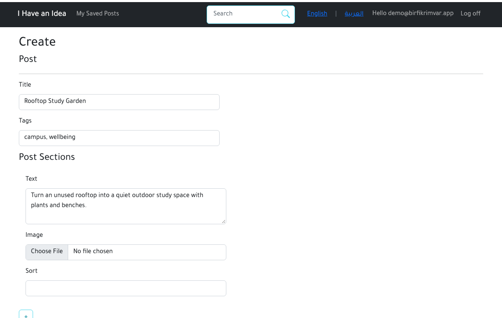 | 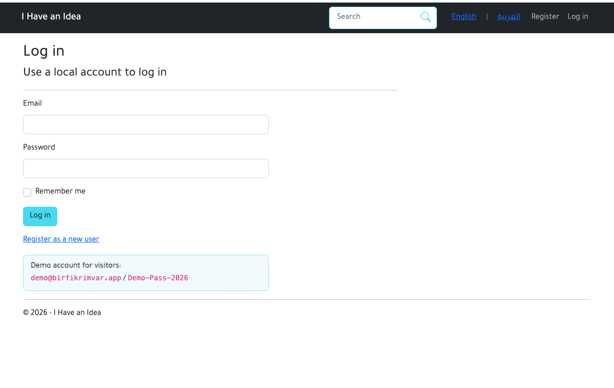 |
| **Moderation queue (admin)** | **Review: publish or reject (admin)** |
| 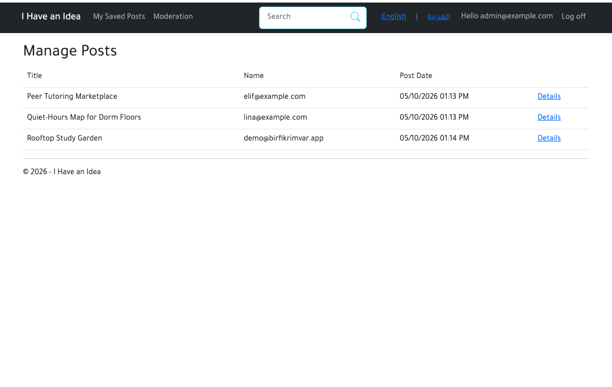 | 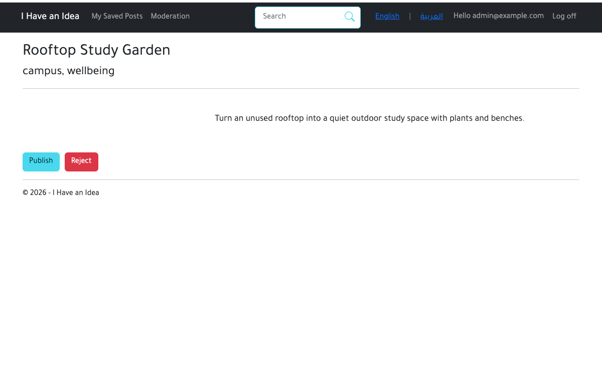 |

<details><summary>Mobile</summary>

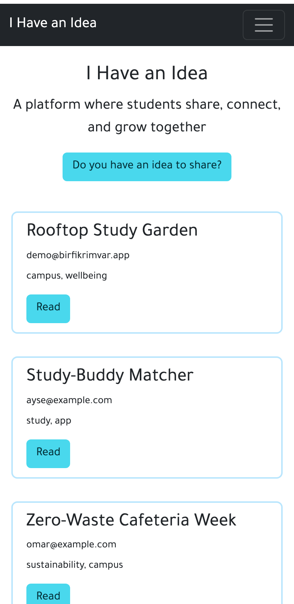

</details>

## Architecture

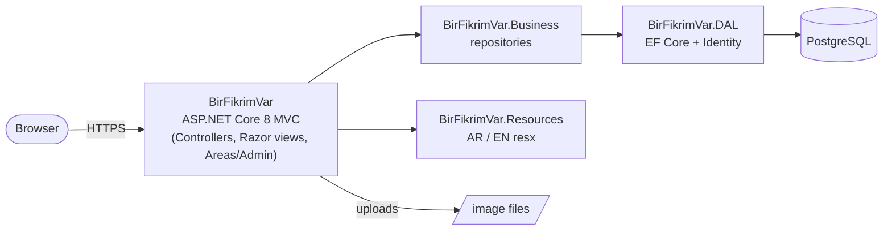

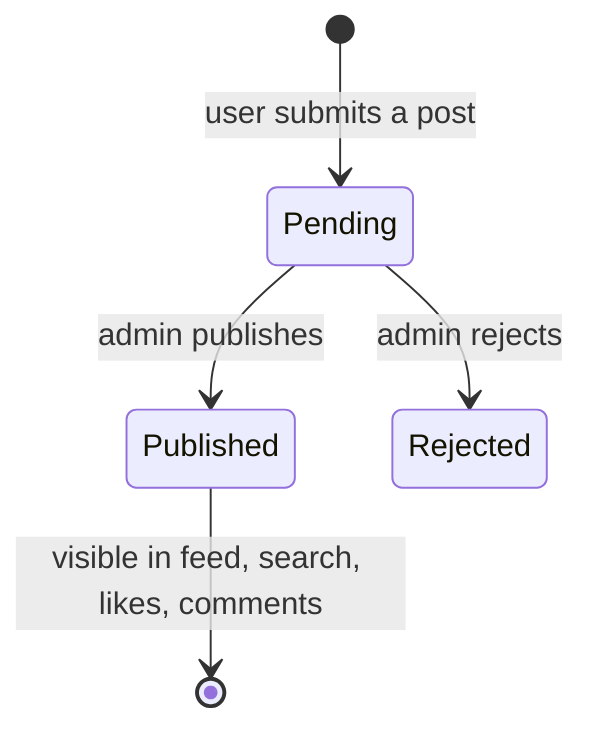

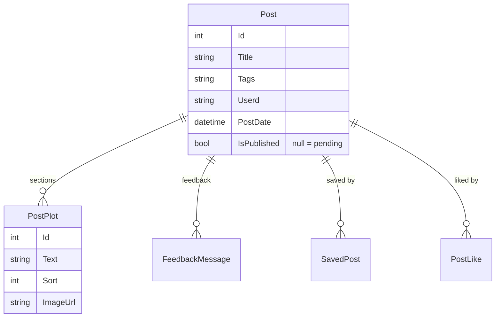

## Tech stack

| Layer | Technology |
|---|---|
| Web | ASP.NET Core 8 MVC, Razor views, Areas (Admin), Bootstrap 5 (+ RTL build), jQuery validation |
| Auth | ASP.NET Core Identity, cookie auth, `Admin` role, lockout |
| Data | Entity Framework Core 8, Npgsql, PostgreSQL 16, EF migrations (applied at startup) |
| i18n | `resx` resources (en / ar), cookie-based culture, RTL layout |
| Hosting | Docker (multi-stage), Render (web service), Neon (PostgreSQL) |

## Project structure

```
BirFikrimVar.sln
├── src/
│   ├── BirFikrimVar/              # Web: controllers, views, Areas/Admin, services, wwwroot
│   ├── BirFikrimVar.Business/     # repositories + interfaces
│   ├── BirFikrimVar.DAL/          # entities, AppDbContext, Identity user, migrations
│   └── BirFikrimVar.Resources/    # PostResources / SharedResources (en, ar)
├── tests/e2e/                     # Playwright end-to-end checks
├── docs/                          # screenshots, demo GIF
├── Dockerfile · docker-compose.yml · .env.example
└── .github/workflows/build.yml
```

## Run locally

**With Docker (recommended)**

```bash
cp .env.example .env        # then edit the passwords
docker compose up --build   # http://localhost:8080
```

**With the .NET 8 SDK and your own PostgreSQL**

```bash
export ConnectionStrings__DefaultConnection="Host=localhost;Database=birfikrimvar;Username=postgres;Password=..."
export Seed__AdminPassword="a-long-password"   # creates admin@example.com (Seed__AdminEmail) in the Admin role
export Seed__DemoData=true Seed__DemoPassword="Demo-Pass-2026" Seed__ShowDemoHint=true   # optional demo content
dotnet run --project src/BirFikrimVar
```

Migrations and seeding run at startup. A `postgres://…` URL in `DATABASE_URL` works too. The admin account is created only when `Seed__AdminPassword` is set; nothing is hard-coded.

**End-to-end tests** (against a freshly seeded instance, they publish/reject the seeded pending posts):

```bash
cd tests/e2e && npm i && npx playwright install chromium
BASE_URL=http://localhost:8080 DEMO_PASSWORD=... ADMIN_PASSWORD=... npm test
```

## Security

Porting was a chance to fix problems in the original (each one is its own commit on `main`):

- The Admin area had no authorization; it is now restricted to the `Admin` role.
- Publish, Reject, Like and Save/Unsave were state-changing GET requests; they are POST with antiforgery validation, and a global antiforgery filter covers every unsafe request.
- Deleting a saved post didn't check who owned it; it does now.
- Search returned unpublished posts, and anyone could open a pending post by id; both are limited to published posts (authors and admins can still open their own).
- The feedback inbox was public; it now needs a login and is limited to the post's author and admins.
- The Create form didn't validate its antiforgery token and bound the entity directly (so `IsPublished` could be over-posted); it now binds a dedicated view model.
- Uploads accepted any file; they are now limited to JPG/PNG/GIF/WebP checked by content, 2 MB each, at most 10 sections, stored under random names.
- The seeded admin password was hard-coded in source; it now comes from configuration.
- Also: CSP and other security headers, per-IP rate limiting on write requests, lockout on repeated failed logins.

## Known limitations

- **Free-tier sleep:** the demo's first load after idle can take ~30–60 s.
- **Uploaded images are ephemeral on the demo:** Render's free disk is wiped on restart/redeploy, so images users upload disappear (the seeded demo images ship with the app). Use a persistent volume or object storage for real use.
- No email: no email confirmation or password reset. The MVC 5 template's two-factor, phone-number and external-login pages were never configured in the original and were not ported.
- The demo's rate limiter is in-memory and per instance.
- Search is a simple substring match; the feed is not paginated.
- Validation messages from the framework (e.g. "The Email field is not a valid email address") are in English only.
- Property names such as `Post.Userd` are kept from the original model.
- Only the end-to-end tests exist; there are no unit tests.

## Author

**Saed O S Radi**: 4th-year Software Engineering student, FSMVU, Istanbul · [@SaadOsama10](https://github.com/SaadOsama10)

© Saed O S Radi. All rights reserved. Code is shared for portfolio purposes only. See [LICENSE](LICENSE).
